# Qurio - A Beautifully Crafted Quotes App

## Introduction

Qurio is more than just a quotes app; it's a Flutter project focused on delivering an exceptional user experience through a polished UI, smooth animations, and robust features. It leverages Firebase for backend services.

## App Screenshot

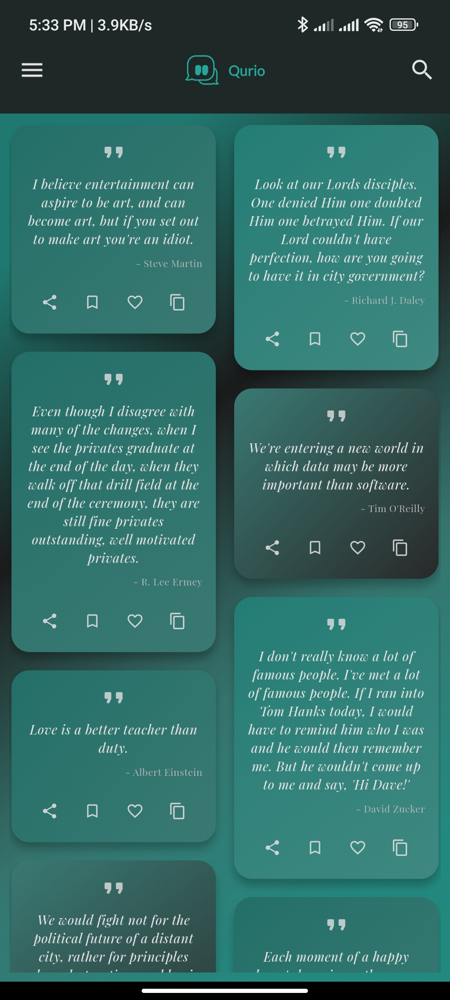
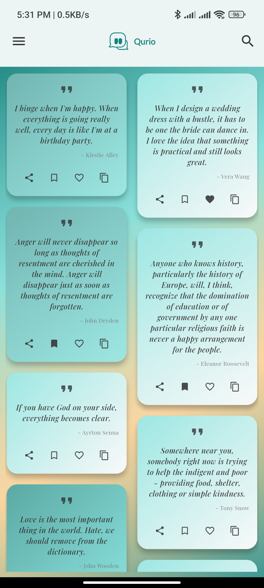
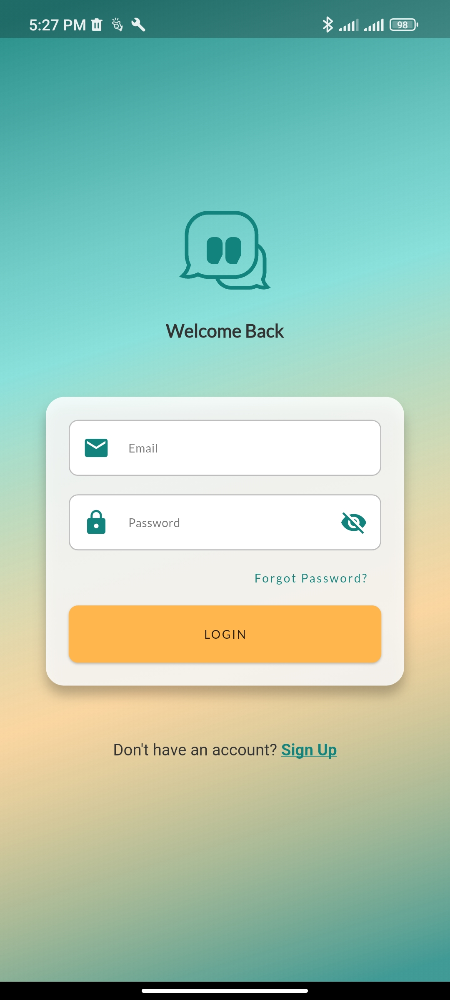
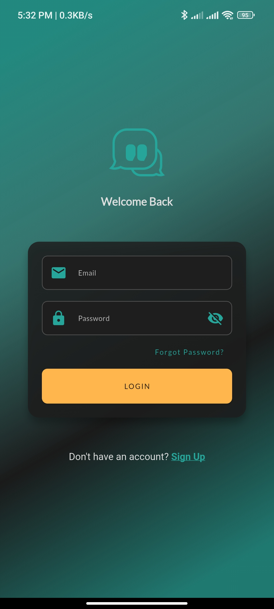
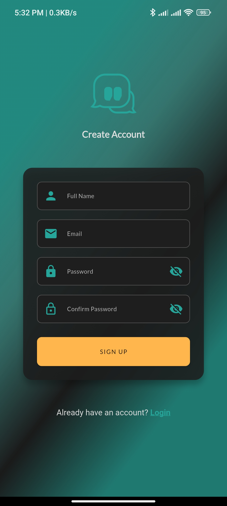
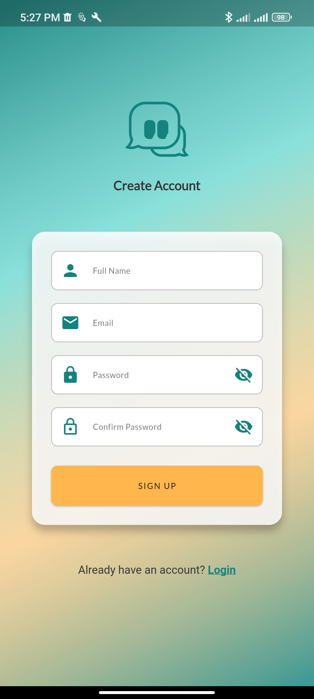
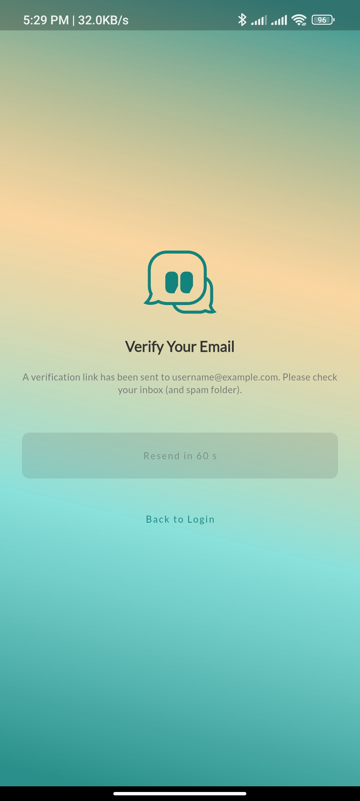
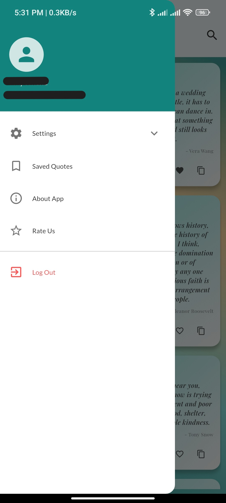
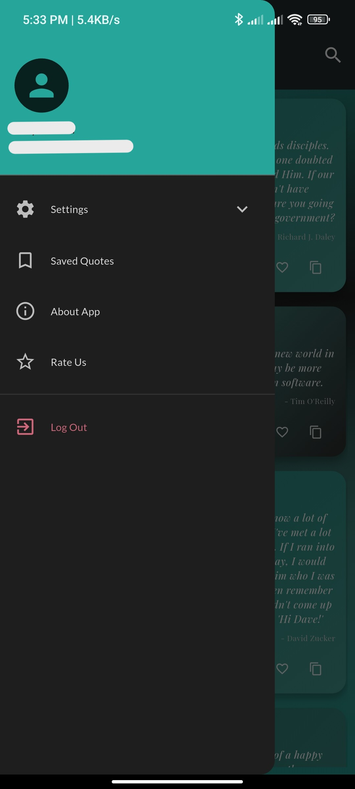
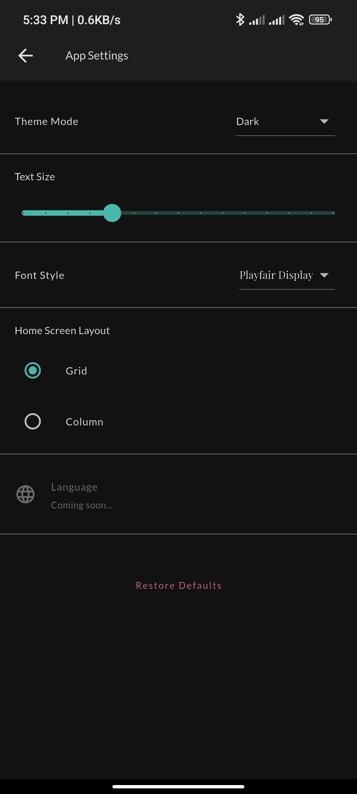
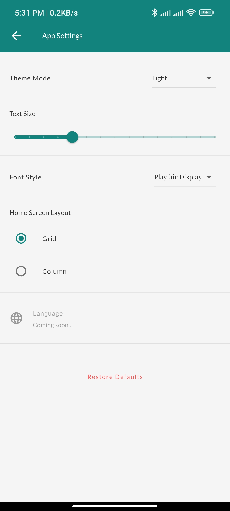
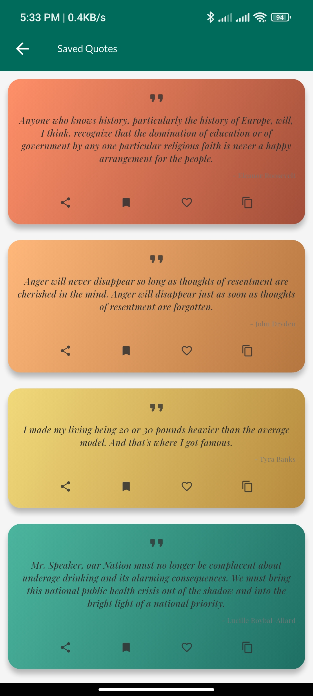
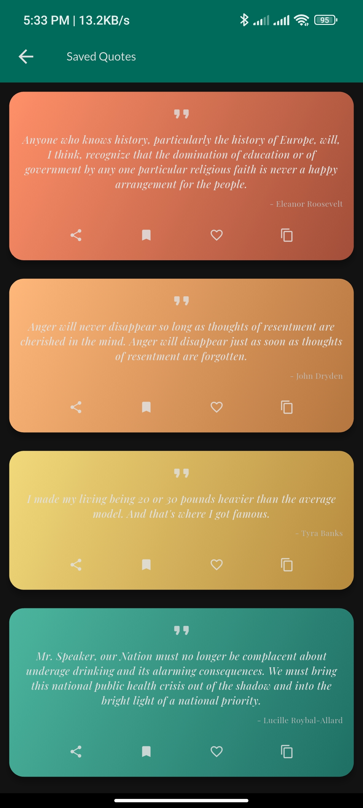

## What's inside

- **Screens & Features:**
    - Splash Screen
    - Authentication Flow (Sign Up, Login, Email Verification, Password Reset) with Animated Background
    - Home Screen (Quote Discovery)
        - Dynamic Staggered Grid Layout (`MasonryGridView`)
        - Infinite Scrolling & Pull-to-Refresh
        - Skeleton Loading Screens (`shimmer` effect)
        - Quote Saving/Unsacing (Firebase Firestore)
    - Saved Quotes Screen
        - Real-time updates (`StreamBuilder`)
        - Swipe-to-Dismiss Deletion
    - App Settings Screen (e.g., Layout Customization)
    - About App Screen
- **Key UI/UX Elements:**
    - Custom App Bar & Drawer
    - Animated Background Widget
    - Quote Card Widget (with dynamic gradients)
    - Haptic Feedback Integration
- **Backend & Services:**
    - Firebase Authentication
    - Firebase Firestore (Quote Storage)
    - Settings Service (Shared Preferences)
    - Quote API Integration (`http`)

## Installation

**Step 1:**

Clone this repo by using the link below:

```
https://github.com/ashy-sandhu/qurio-app.git
```

**Step 2:**

Ensure you have Flutter installed ([Flutter installation guide](https://docs.flutter.dev/get-started/install)) and a Firebase project set up ([Firebase Console](https://console.firebase.google.com/)).

**Step 3:**

Configure Firebase for your Flutter app by following the [FlutterFire setup guide](https://firebase.google.com/docs/flutter/setup). Ensure you enable **Firebase Authentication** (Email/Password) and **Cloud Firestore**.

**Step 4:**

Go to the project root and execute the following command in the console to get the required dependencies:

```
flutter pub get
```

**Step 5:**

You can run this project using this command:

```sh
flutter run
```

## About the Author

Qurio is Developed by [Ahsan Malik/Code Harbor].

*   GitHub: [https://github.com/ashy-sandhu]
*   LinkedIn: [www.linkedin.com/in/ahsan-malik-2990722b9]

## Thanks To

Special thanks to the creators of the Flutter framework and the following packages used in this project:

*   `firebase_core`, `firebase_auth`, `cloud_firestore`
*   `provider`
*   `flutter_staggered_grid_view`
*   `shimmer`
*   `google_fonts`
*   `http`
*   `share_plus`
*   And other dependencies listed in `pubspec.yaml`.

## License

Qurio